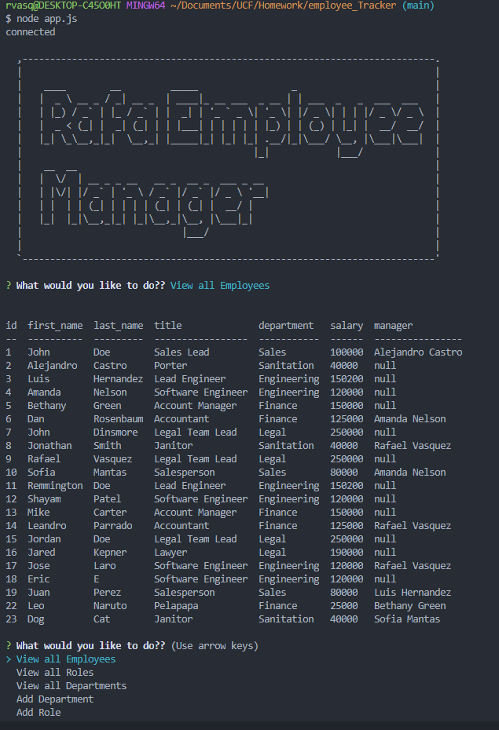

# Employee Tracker

## Task

Architect and build a solution for managing a company's employees using node, inquirer, and MySQL.

The application will be invoked by using the following command:

```
npm start || node app.js
```
  ## Table of Contents

  1. [User Story](#user-story)
  2. [Built With](#built-with)
  3. [How to Install](#how-to-install)
  4. [How to Use](#how-to-use)
  5. [Submission](#submission)
  6. [Example Schema](#example-schema)
  7. [Questions](#questions)

## User Story

```
As a business owner I want to be able to view and manage the departments, roles, and employees in my company
So that I can organize and plan my business
```
### Built With
----
```
  * Node.js
  * Javascript
  * Node Modules
    - mysql (database manipulation)
    - inquirer (prompt questions)
    - asciiart-logo (for intro logo)
    - console.table (format tables)
```    
### How to Install
----
```
npm i
```

### How to Use
----
```
  1- Type "node app.js" in the console.
  2- View all Employees - All employees of the company with roles,    salary and department.
  3- View all Roles - All roles available
  4- View all Department - All departments available
  5- Add Aepartment - Add new department
  6- Add Role - Add new Role
  7- Add Employee - Add new employee with role id and Manager id
  8- Remove Employee - Remove employee from the Table
  9- Remove Role - Remove Roles from Table
  10- Remove Department - Remove Department from Table
  11- Update Employee Role - Update the role of the employee
  12- Update Employee Manager - Update the manager of the employee
  13- Employees by Manager - You can see the employees under specific manager
  14- Total Salary by Department - You can see the Salary by Department
  15- Done - Close the connection with the db.
```    
### Submission
---

Github Repo URL: 
[https://github.com/v1zconde/employee_Tracker](https://github.com/v1zconde/employee_Tracker)

How to use Video: 
[Watch Video](https://drive.google.com/file/d/1585vLDFWIqj2AOY8yCYOHdb8PJXKOc70/view)

### Example Schema


---
### All Employees Table



  ## Questions
you have any questions about the repo, open an issue or contact me directly at rvasquez1@gmail.com. You can find more of my work at 
  Github: [v1zconde](http://github.com/v1zconde)

